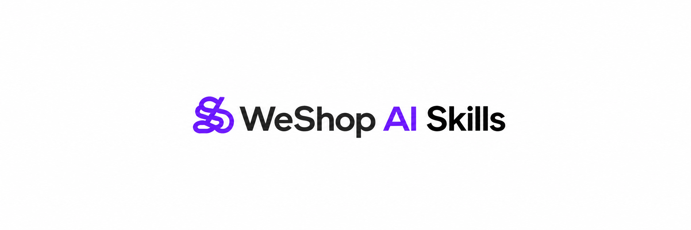

<p align="center">
  
</p>

<p align="center">
  Creative AI Skills for Codex, Claude Code, Cursor, and any Agent Skills-compatible runtime.
</p>

<p align="center">
  
  
  
  
  
</p>

WeShop Skills turns plain-language creative requests into production-ready image, video, product, portrait, layout, and spatial workflows powered by WeShop OpenAPI. Install the complete collection or pick only the Skills you need.

> This repository contains **76 focused Atom Skills + 1 adaptive Router**. It also includes a standalone `weshop-skill` CLI, so the official WeShop CLI is not required.

## 🚀 Install with one prompt

Open Codex, Claude Code, or Cursor and paste this:

```text
Install the latest stable GitHub Release of all WeShop Skills from https://github.com/weshopai/weshop-skill-pakage for the agent you are running in. Clone the repository, check out the newest stable vX.Y.Z tag in detached mode, install its npm dependencies, use its skills manager to install all Skills into the correct global skills directory for this agent, enable the package's silent Release-based auto-updater, verify the installation, and tell me whether I need to restart the agent. Do not ask me to paste or print my WeShop API key.
```

The agent should clone this repository, run `npm ci`, and install the Skills into its own global Skill directory.

## 📦 Install manually

### 1. Clone the package

```bash
git clone https://github.com/weshopai/weshop-skill-pakage.git
cd weshop-skill-pakage
git checkout --detach "$(git tag --list 'v[0-9]*' --sort=-v:refname | head -n 1)"
npm ci
```

Node.js 22 LTS, npm, Git, and access to this repository are required.

### 2. Choose your agent

<details open>
<summary><strong>Codex</strong></summary>

```bash
npm run skills:manage -- install --all
```

The default destination is `~/.codex/skills`.

</details>

<details>
<summary><strong>Claude Code</strong></summary>

```bash
npm run skills:manage -- install --all --target ~/.claude/skills
```

</details>

<details>
<summary><strong>Cursor</strong></summary>

```bash
npm run skills:manage -- install --all --target ~/.cursor/skills
```

</details>

Restart the agent after the first installation so it can discover the new Skills.

### 3. Enable silent Skill updates

After installing all Skills, enable the background updater once:

```bash
npm run skills:auto-update -- install
```

It checks every six hours for the latest stable GitHub Release. When the repository is clean and the release is a safe fast-forward update, it advances the detached release checkout and synchronizes every managed installation. It never follows unreleased changes on `main`. If you installed `--all`, Skills added in future releases are installed automatically too.

```bash
npm run skills:auto-update -- status
npm run skills:auto-update -- check
npm run skills:auto-update -- uninstall
```

The updater uses the Git credentials already configured for this private repository. Successful checks are silent; state and errors are stored under `~/.weshop-skill-package/`. It never overwrites a dirty or diverged checkout. Newly added Skills become visible when the agent next refreshes its Skill list, usually in a new task or after an app reload.

By default, installation uses symlinks, so pulling this repository updates the installed Skill content immediately. Add `--copy` if you need an isolated copy:

```bash
npm run skills:manage -- install --all --copy
```

### 4. Configure WeShop OpenAPI

Get a key from [WeShop OpenAPI](https://www.weshop.ai/apiKey), then provide it only to the trusted local process that performs generation:

```bash
read -s WESHOP_API_KEY && export WESHOP_API_KEY
npm run api-key:check
```

Never paste the key into chat, source files, frontend code, Git history, URLs, or command arguments.

## 💬 Use it

You do not need to memorize Skill names. Describe the result you want and the Router will select and combine the right Skills.

Try prompts like:

```text
Turn this product photo into a clean white-background marketplace hero image. Keep the product shape, label, and colors unchanged.
```

```text
Put this jacket on the model, preserve the garment logo and fit, then create a matching lifestyle campaign image.
```

```text
Remove the person in the background, expand this photo to 16:9, and animate it into a five-second cinematic shot.
```

```text
Create one minimal logo for NORTHLINE COFFEE: an original N plus mountain-path symbol in black and cream.
```

You can also invoke a Skill directly, for example `$remove-background`, `$virtual-try-on`, `$create-logo`, or `$generate-video`.

## ✨ What you get

| Capability | Examples |
| --- | --- |
| 🛒 Product & e-commerce | Product scenes, packaging, white-background mockups, virtual try-on, model replacement |
| 🎨 Image creation | Logos, characters, animals, banners, posters, thumbnails, infographics |
| ✂️ Image editing | Remove objects or backgrounds, expand, recolor, retouch, clean, restore |
| 🧑 Portrait & appearance | Headshots, ID photos, makeup, hair, pose, glasses, tattoos |
| 🎬 Video | Image animation, talking video, intros, effects, editing, combining, upscaling |
| 🏠 Space & design | Room restyling, landscape previews, floor plans, flowcharts, CAD |
| 🧠 Multi-step routing | Natural-language planning, parallel or ordered Skills, asset handoff, final QA |
| 🛡️ Safe execution | Stable operation keys, duplicate-spend protection, polling, recovery records |

The Router discovers installed Skills from their descriptions, decomposes compound requests, connects outputs to downstream inputs, selects verified WeShop models or Agents, and performs one focused acceptance check on the final result.

## Complete Skill inventory 🧩

The `skills/` directory contains 76 Atom Skills and one Router. Categories below are for browsing only and do not participate in hard-coded Router selection.

| Category | Skills |
| --- | --- |
| Router | `weshop-router` |
| Commercial products and apparel | `ai-product`, `change-pose`, `create-white-background-product-mockup`, `fashion-model-replacement`, `outfit-design`, `product-packaging`, `virtual-try-on` |
| Layout and marketing | `ai-banner-design`, `add-speech-bubble`, `apply-photo-filter`, `compose-lookbook`, `image-combiner`, `make-infographic`, `make-silhouette`, `make-thumbnail`, `photo-collage`, `poster-design`, `product-detail-page`, `recolor-object`, `recreate-social-photo`, `translate-image-text` |
| Personal appearance | `add-braces`, `add-tattoo`, `apply-makeup`, `change-bangs`, `eye-color-change`, `hair-color-change`, `hairstyle-change`, `make-selfie`, `shave-head` |
| Portrait production | `id-photo-format`, `professional-headshot` |
| Image repair and utilities | `clean-room`, `colorize-image`, `expand-image`, `remove-background`, `remove-glasses`, `remove-image-mark`, `remove-object`, `remove-photo-filter`, `retouch-blemish`, `smooth-wrinkles` |
| Characters, animals, and brands | `character-reference-sheet`, `create-animal`, `create-avatar`, `create-character`, `create-flag`, `create-logo`, `create-mascot-logo`, `create-npc`, `make-pet-portrait` |
| Narrative and comics | `plan-comic-storyboard`, `render-comic-page` |
| Spaces, diagrams, and CAD | `create-cad`, `make-flowchart`, `preview-landscape`, `preview-paint`, `restyle-room`, `visualize-floor-plan` |
| Video | `add-video-effect`, `animate-image`, `combine-videos`, `correct-video-color`, `edit-social-video`, `generate-video`, `make-podcast-video`, `make-talking-video`, `make-video-intro`, `remove-video-mark`, `restyle-video`, `upscale-video` |
| Social and commemorative | `make-birthday-video`, `make-holiday-card`, `make-mugshot-photo`, `make-wallet-photo`, `make-wedding-photo` |

List them from your terminal:

```bash
npm run skills:manage -- list
```

Install only what you need:

```bash
npm run skills:manage -- install create-logo
npm run skills:manage -- install weshop-router
```

## ⌨️ Built-in WeShop CLI

The package includes `weshop-skill`, a direct WeShop OpenAPI CLI for uploads, Agent discovery, generation, polling, and operation-ledger inspection. It supports the Standard and Premium Agents enabled for your account and does not depend on the official `weshop-cli` package.

```bash
npm run cli -- --help
npm run cli -- info aiproduct
npm run cli -- upload ./product.png
```

Run an Agent directly:

```bash
weshop-skill run gpt-image \
  --operation-key campaign-logo-v1 \
  --params '{"textDescription":"Create a clean geometric logo","quality":"medium","imageSize":"2K","batchCount":1}'
```

Local images can be written as `file:./image.png` inside `--input` or `--params` JSON. Each submission requires a stable `--operation-key`; the CLI waits for completion by default and prevents blind duplicate submissions.

## 🔄 Update

Automatic-update users do not need to run a manual update command. To update immediately instead of waiting for the next background check:

```bash
npm run skills:auto-update -- run
```

Inspect one managed Skill at any time:

```bash
npm run skills:manage -- status create-logo
```

## 🏗️ For maintainers

Start with [CONTRIBUTING.md](CONTRIBUTING.md) and the [maintainer guide](docs/maintainers/README.md). The repository includes separate workflows for [creating a Skill](docs/maintainers/adding-skills.md) and [adapting an external project to WeShop](docs/maintainers/importing-external-projects.md).

Useful commands:

| Command | Purpose |
| --- | --- |
| `npm run build` | Compile TypeScript and prepare the CLI |
| `npm run check` | Run TypeScript checks |
| `npm test` | Test routing and execution safety |
| `npm run models:validate` | Validate the model catalog |
| `npm run models:routing-validate` | Validate model routes across all 76 Atom Skills |
| `npm run docs:validate` | Validate this README and Skill inventory |
| `npm run maintainers:validate` | Validate maintainer documentation |
| `npm run web:build` | Build the generated visual Skill catalog |
| `npm run skills:intake -- ...` | Start a provenance-safe external Skill intake |
| `npm run skills:auto-update -- ...` | Install or inspect the Release-based background updater |

## 🔒 Security

- `WESHOP_API_KEY` is read from the environment and sent only to `https://openapi.weshop.ai`.
- Every generation uses a durable operation key before submission.
- A missing or ambiguous execution receipt blocks automatic resubmission to avoid duplicate output and spend.
- Accepted runs are polled by execution ID; downstream download or publication failures do not trigger regeneration.

## 📄 License

Available under the [MIT License](https://github.com/weshopai/weshop-skill-pakage/blob/main/LICENSE).

---

Built with ❤️ by the WeShop AI team.
